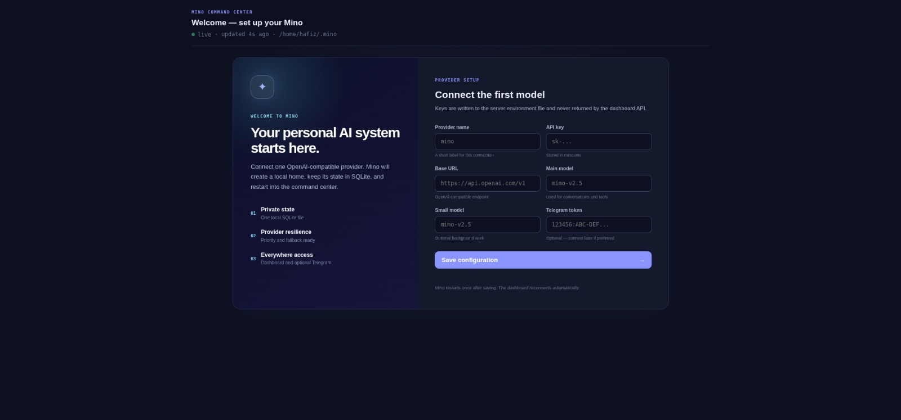

# Mino — personal AI agent

One binary. One SQLite file. Your own AI assistant.

[](https://deepwiki.com/H4fizWasabie/mino-agent)

- **Dashboard** — chat, memory, tools, file browser
- **Telegram** — chat on the go
- **Tools** — file ops, calendar, notes, web search, image generation, recall
- **Extensions** — plug in external tools via HTTP
- **MCP** — Model Context Protocol servers (filesystem, databases, etc.)
- **Skills** — save repeatable workflows as markdown files

## Quickstart

```bash
# Download (requires Go 1.22+)
git clone https://github.com/H4fizWasabie/mino-agent.git
cd mino-agent
go build -tags sqlite_fts5 -o mino .

# Run — dashboard opens in your browser automatically
./mino
```

No API key? The onboarding page lets you add one. No terminal needed.



**Want it available everywhere?**

```bash
sudo cp mino /usr/local/bin/
hash -r
mino
```

**Advanced: CLI mode**

```bash
export MINO_API_KEY=sk-...
export MINO_BASE_URL=https://api.openai.com/v1
export MINO_MODEL=gpt-4.1-mini
./mino cli
```

## Commands

| Command | What |
|---------|------|
| `mino` | Launch dashboard (default) |
| `mino cli` | Terminal chat |
| `mino version` | Show version |
| `mino update` | Self-update from GitHub releases |

No API keys? The dashboard has an onboarding page to set them up. No more panics.

## Configuration

| Env | Default | Description |
|-----|---------|-------------|
| `MINO_HOME` | `~/.mino` | State directory (DB, config, traces) |
| `MINO_API_KEY` | — | OpenAI-compatible API key |
| `MINO_BASE_URL` | `https://api.openai.com/v1` | API base URL |
| `MINO_MODEL` | `gpt-4o-mini` | Main model |
| `MINO_SMALL_MODEL` | `gpt-4o-mini` | Model for background tasks |
| `MINO_DASHBOARD_PORT` | `7779` | Dashboard port |
| `MINO_DASHBOARD_HOST` | (all interfaces) | Bind address (e.g. `127.0.0.1` or Tailscale IP) |
| `MINO_MAX_ITERATIONS` | `10` | Max tool calls per turn |
| `MINO_MAX_TOKENS` | `4096` | Max output tokens |
| `MINO_CONTEXT_CHARS` | `100000` | Context window budget in chars |
| `TELEGRAM_BOT_TOKEN` | — | Optional Telegram bot token |
| `HF_TOKEN` | — | HuggingFace token (for FLUX.1-schnell, optional) |
| `TAVILY_API_KEY` | — | Optional — enriches web search (falls back to DuckDuckGo) |
| `MINO_OPENROUTER_KEY` | — | OpenRouter key (for embeddings, fallback search) |

See `.env.example` for a copy-paste template.

## Architecture

```
Mino is ~2000 lines of Go:

main.go          — entry point, wires everything
loop.go          — agent loop: reason → act → observe
session.go       — SOUL.md, system prompt, context assembly
memory.go        — SQLite + FTS5 retrieval, consolidation
tools.go         — built-in tools (file, calendar, notes, search, image gen)
provider.go      — OpenAI-compatible client + SSE streaming
provider_manager.go — priority, retry, fallback, circuit breaking
telegram.go      — Telegram bot gateway
telegram_format.go — Markdown→HTML formatting for Telegram
dashboard.go     — web UI + REST API
mcp.go           — MCP bridge (stdio-based servers)
skill.go         — skill loader (SKILL.md files)
extensions.go    — HTTP extension protocol
checkpoint.go    — task survival across restarts
scheduler.go     — cron engine for proactive tasks
artifacts.go     — large output management
```

## Free AI stack

Mino can run entirely on free tiers:

- **LLM**: [Google Gemma 4](https://openrouter.ai/google/gemma-4-31b-it) (free on OpenRouter, no cost)
- **Image gen**: [Pollinations.ai](https://pollinations.ai) (free, no key)
- **Embeddings**: via OpenRouter (free tier available)
- **Web search**: DuckDuckGo (built-in, keyless). Optional Tavily upgrade for richer results.
- **URL fetch**: pipes HTML through markitdown — preserves tables, headings, links for better LLM reading

## Local LLMs

Run models on your own hardware — no API keys, no internet:

### Ollama

```bash
# Install: https://ollama.com
ollama pull llama3.1:8b
```

Create `~/.mino/providers.json`:

```json
{
  "providers": [
    {
      "name": "ollama",
      "priority": 1,
      "base_url": "http://localhost:11434/v1",
      "api_key_env": "",
      "model": "llama3.1:8b",
      "small_model": "llama3.1:8b"
    }
  ]
}
```

`""` for `api_key_env` means no auth required. Works with LM Studio, vLLM, and any OpenAI-compatible local server too.

## Extensions

External tools connect via HTTP. Create `~/.mino/extensions.json`:

```json
[
  {"name": "my-tool", "url": "http://localhost:9100"}
]
```

Mino discovers tools via `GET /tools` and proxies calls via `POST /execute`.

### minowrap — universal tool adapter

Add any CLI command as a tool in one JSON line. Ships with Mino:

```json
// ~/.minowrap/tools.json
[
  {"name": "disk_usage", "description": "Show disk usage for a path", "run": "df -h {path}"},
  {"name": "deploy", "description": "Deploy the app", "run": "curl -X POST https://api.example.com/deploy"}
]
```

Template args like `{path}` auto-generate JSON Schema. Mino discovers them on next `reload_plugins` call. No restart, no coding, any language.

See the [extension protocol](extensions.go) for details.

## MCP servers

Drop JSON configs in `~/.mino/mcp.d/`:

```json
{"name": "fs", "command": "npx", "args": ["-y", "@modelcontextprotocol/server-filesystem", "/path/to/dir"]}
```

Tools are prefixed as `MCP_<server>_<tool>`.

## License

MIT
